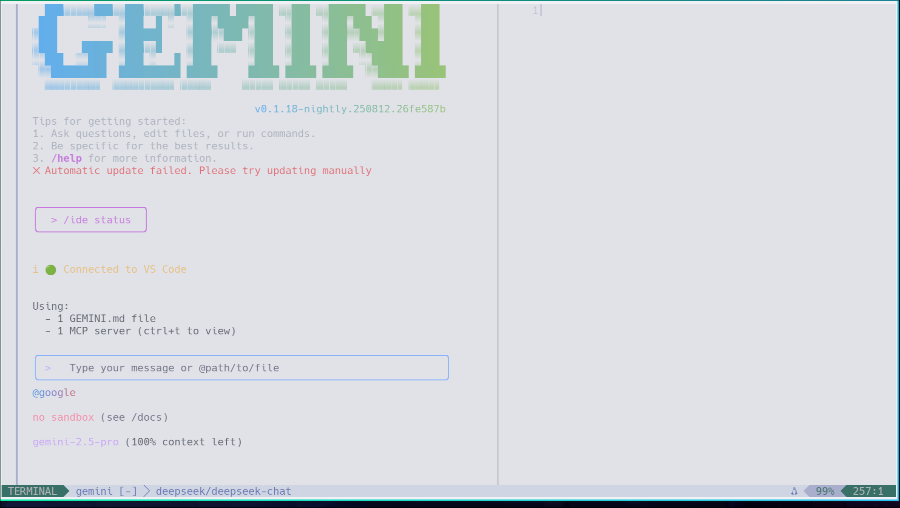
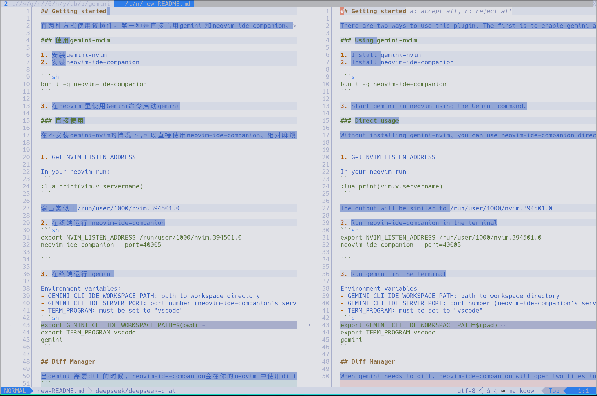

## Getting started

There are two ways to use this plugin. The first is to enable gemini and neovim-ide-companion directly. The second is to use [gemini-nvim](https://github.com/JunYang-tes/gemini-nvim).

### Using gemini-nvim

1. Install gemini-nvim
2. Install neovim-ide-companion

```sh
bun i -g neovim-ide-companion
```

3. Start gemini in neovim using the Gemini command.

### Direct usage

Without installing gemini-nvim, you can use neovim-ide-companion directly, which is a bit more complicated.


1. Get NVIM_LISTEN_ADDRESS

In your neovim run:
```
:lua print(vim.v.servername)
```

The output will be similar to /run/user/1000/nvim.394501.0

2. Run neovim-ide-companion in the terminal
```sh
export NVIM_LISTEN_ADDRESS=/run/user/1000/nvim.394501.0
neovim-ide-companion --port=40005

```

3. Run gemini in the terminal

Environment variables:
- GEMINI_CLI_IDE_WORKSPACE_PATH: path to workspace directory
- GEMINI_CLI_IDE_SERVER_PORT: port number (neovim-ide-companion's server port)
- TERM_PROGRAM: must be set to "vscode" 
```sh
export GEMINI_CLI_IDE_WORKSPACE_PATH=$(pwd)
export GEMINI_CLI_IDE_SERVER_PORT=40005
export TERM_PROGRAM=vscode
gemini
```

## Diff Manager

When gemini needs to diff, neovim-ide-companion will open two files in your neovim using the diff command. At this point, you can press 'a' to accept all, or 'r' to reject all. You can directly edit the content generated by gemini (usually on the right, named new-xxx). After you have finished editing new-xxx, press 'a' in normal mode to accept all. You can also use `:w` to write to new-xxx, which will automatically accept the changes.


>`:help diff` for more information.

